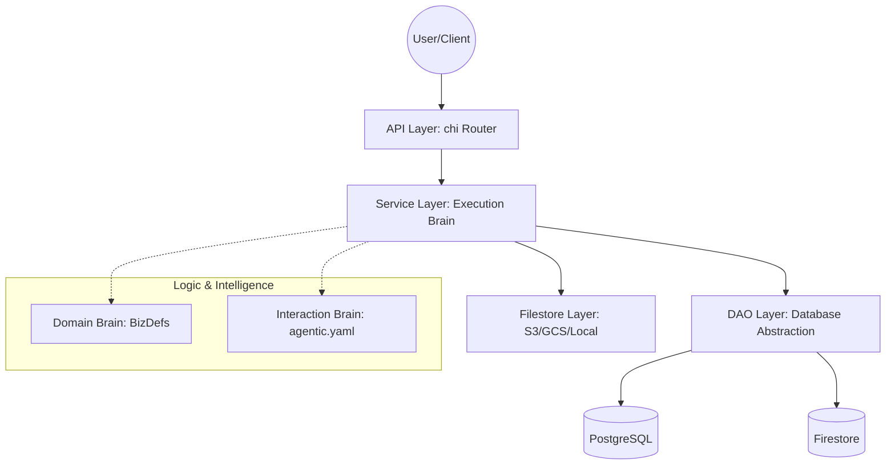
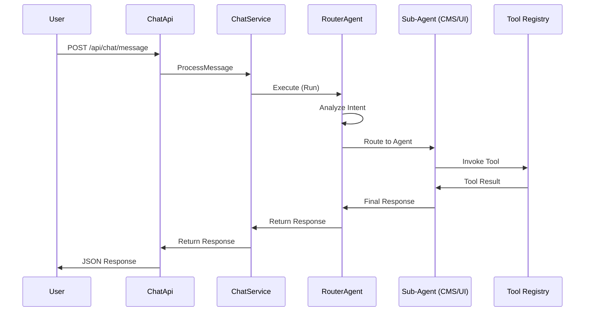

# AIGenApp Architecture

This document describes the high-level architecture of AIGenApp, its core concepts, and how different components interact.

## Core Philosophy: Schema-on-Read

Unlike traditional CMS or ERP systems that create physical database tables for each entity, AIGenApp uses a **Single-Table JSON Store** approach. 

- **Persistence Layer**: All data is stored in a single table (e.g., `aigen_records` in Postgres or a single collection in Firestore).
- **Structure**: Each record consists of a Namespace (BizDef), a Key (Unique ID), a JSON blob (`Rec`), and Metadata.
- **Flexibility**: Changes to schemas do not require SQL migrations. The application logic interprets the JSON data based on dynamic definitions.

---

## Key Concepts

### 1. BizDefs (Business Definitions)
A **BizDef** in AIGenApp is a logical container for business logic, schemas, and data.
- **Discovery**: Defined in `bizdefs/` directories via a `bizdef.json` manifest.
- **Components**: A BizDef includes its own schemas, default data, UI configurations, and documentation.
- **Isolation**: Roles and permissions are typically scoped to a BizDef namespace.

### 2. Entities & Schemas
Data within a BizDef is organized into **Entities**.
- **Schema**: Defined in JSON files (e.g., `crm_lead.json`). These schemas describe attributes, data types, validation rules, and UI hints (e.g., "this field is an email").
- **Dynamic Modeling**: Entities are "realized" at runtime. The `SchemaService` parses these definitions to provide CRUD operations and GraphQL types.

### 3. Channels
**Channels** represent the communication interfaces between the system and the outside world.
- **Multi-Channel**: Supports WhatsApp, Email, Signal, Telegram, etc.
- **Identity**: Channels map external platform IDs (e.g., a phone number) to internal User profiles.
- **Guest Support**: Each channel can be configured to allow or deny unauthenticated interactions.

### 4. Services (The Business Logic Layer)
Services are the heart of the system. They are responsible for business logic, data validation, and orchestration.
- **Stateless**: Services generally do not hold state themselves; they rely on DAOs for persistence.
- **Isolation**: Services should not know about HTTP or specific API details. They take a `context.Context` and specialized descriptors as input.
- **Examples**: `EntityService`, `AuthService`, `ChannelService`, `TempAccessService`.

### 5. APIs (The Transport Layer)
APIs handle the "outer shell" of the application.
- **Routing**: Built on `net/http` and `chi`.
- **Handling**: APIs parse HTTP requests (JSON, Multipart, Query params), enforce basic authentication (JWT Middleware), and delegate work to Services.
- **MCP API**: A specialized management API for administrative tasks (like clearing caches or managing temporary files).

## Business Logic & The "Brain"

Business logic in AIGenApp is not centralized in a single layer; it is distributed across three distinct "brains" that separate domain rules, interaction strategies, and technical execution.

### 1. The Domain Brain (The "What")
**Location**: `bizdefs/{bizdef_name}/` (Manifests, Schemas, and Markdown Docs)

The **Domain Brain** defines the fundamental rules of the business (e.g., "A Lead must have an email," "A Deal belongs to an Organization").
- **Declarative**: Rules are defined via JSON schemas and natural language documentation (`docs/*.md`).
- **Persistence-Agnostic**: These rules exist independently of the AI or the database.
- **Introspection**: AI agents use tools to "read" this brain to understand the domain they are operating in.

### 2. The Interaction Brain (The "How")
**Location**: `agentic.yaml` (Agent Graph and Orchestration)

The **Interaction Brain** defines the intelligence behind how the system perceives user intent and routes tasks.
- **Orchestration**: It defines the hierarchy of agents (Router -> CMS -> UI).
- **Strategy**: It decides which sub-agent should handle a request and which tools are available to them.
- **Reasoning**: It translates natural language intent into structured system actions.

### 3. The Execution Brain (The "Engine")
**Location**: `core/services/` (Go Services)

The **Execution Brain** is the technical engine that implements the "how-to" of the platform.
- **Polymorphic**: Services like `EntityService` or `AuthService` are generic; they don't know about specific business domains but know how to enforce permissions, validate JSON, and interact with the DAO layer.
- **Schema Evolution**: The `EvolutionService` provides a declarative mechanism for migrating data shapes without downtime. It supports JIT transformations on read/write and asynchronous batch scrubbing for large datasets.
- **Security**: Enforces the underlying system integrity (JWT verification, namespace isolation).

---

## Schema Evolution

AIGenApp handles the evolution of business data through a **Declarative Transformation Timeline**. Because the data is stored as JSON, changes to schemas do not require blocking SQL `ALTER TABLE` commands.

### 1. The Evolution Manifest (`evolution.json`)
Each BizDef can define an `evolution.json` file. This file acts as a machine-readable timeline of changes:
- **Versions**: Each version is associated with a date and a set of actions.
- **Actions**: Supported actions include `rename` (move data between keys), `add` (populate missing fields with defaults), and `drop` (cleanup obsolete data).

### 2. Just-In-Time (JIT) Upgrades
The `EntityService` automatically upgrades records "on the fly" when they are read or updated. If a record's metadata indicates it is on an older version than the manifest, the `EvolutionService` applies the necessary transformations before returning the data to the requester.

### 3. Asynchronous Batch Migrations ("Scrubbing")
For large datasets, an administrator can trigger a background "Scrubber" via the `cms_bizdef_evolve` tool. This process iterates through all records of an entity and permanently upgrades them in the database. 
- **Integrity**: Uses **Optimistic Concurrency Control (OCC)** via a `Revision` field in metadata to ensure that background migrations never overwrite live user updates.

---

## Architectural Layers

### Infrastructure Abstraction
AIGenApp is designed to be cloud-agnostic:
- **`IPrimaryDao`**: Abstracts the database (Postgres, Firestore, or Memory).
- **`IFileStore`**: Abstracts the storage (Local, S3, GCS, or Postgres-BLOB).

## Relationship & Data Flow

1. **Request**: A user sends a request to an API endpoint (e.g., `GET /api/entity/crm/lead/123`).
2. **Auth**: The `AuthMiddleware` verifies the JWT and populates the context with the user's role and identity.
3. **Logic**: The `EntityApi` calls the `EntityService`.
4. **Schema Check**: The `EntityService` consults the `SchemaService` to ensure the requested entity (`crm/lead`) is valid and the user has permission to read it.
5. **Fetch**: The `EntityService` calls the `IPrimaryDao` to retrieve the JSON record from the database.
6. **Transformation**: The data is mapped to the requested format (JSON or GraphQL) and returned up the chain.

## Extension Points

- **Downstream BizDefs**: Add new business domains by creating a folder in `bizdefs/`.
- **Custom Tools**: Extend the agentic capabilities by adding tools to `core/agentic/tools/`.
- **New Channels**: Implement the `ChannelService` patterns for new messaging platforms.
- **Signed Applets**: Package BizDefs, Agents, and polyglot tools into signed JAR files for secure, dynamic distribution.

## Applet Extension System

AIGenApp supports a modular extension system called **Applets** (or **App Extensions**). Applets are self-contained, digitally signed JAR files that can dynamically extend the system's capabilities.

### 1. The Applet Package
An Applet JAR includes:
- **`bizdef/`**: Entity schemas and migration manifests.
- **`agentic/`**: Extensions to the interaction brain (`agentic.yaml`).
- **`scripts/`**: Polyglot business logic (JavaScript, Lua, Starlark).
- **`wasm/`**: High-performance binaries for complex processing.
- **`wwwroot/`**: Frontend assets and custom A2UI components.

### 2. Security & Trust Model
To maintain system integrity, Applets follow a strict trust protocol:
- **Digital Signatures**: All extensions must be signed using RSA/SHA256. 
- **Whitelist Verification**: The host only activates extensions signed by trusted authorities or manually "trusted" by an administrator.
- **Polyglot Sandbox**: All extension code (JS, WASM, etc.) runs in a memory-safe, resource-capped sandbox.
- **Managed Host API**: Sandboxed scripts cannot access the host directly; they interact through a restricted `AIGenHostAPI` bridge that enforces RBAC and auditing.

### 3. Dynamic Lifecycle
Extensions are managed via the **Extension Management API**:
- **Discovery**: The `AppExtensionService` automatically detects new JAR files in the configured extensions directory (defaults to `app-extensions` or `./app-extensions`, and can be customized via `app_extensions_dir` in configuration or the `FORMCMS_APP_EXTENSIONS_DIR` environment variable).
- **Mounting**: When activated, the extension's BizDefs are registered with the `SchemaService`, and its agents are merged into the `ChatService` registry on-the-fly.
- **Hot-Swapping**: Functionality can be added or updated without restarting the primary AIGenApp process.

### 4. Extension-Aware Routing
The **RouterAgent** is natively aware of activated extensions. 
- **Doc Analysis**: The router introspects extension metadata and documentation to understand their capabilities.
- **Agent Transfer**: If a user's intent matches an extension's domain, the router loads the extension's `agentic.yaml` and delegates the conversation to its `root_agent`.

### 5. Permission Management & Secure Vault
Applets operate under a **Least Privilege** model:
- **Manifest-Based Permissions**: Extensions must declare required permissions (e.g., `http`, `bizdef`) in their manifest.
- **Admin Authorization**: Sensitive permissions (like external network access) must be explicitly authorized by an administrator. All grants are logged in the **Audit Log**.
- **Secure Vault**: Sensitive credentials (API keys, secrets) are stored in an encrypted vault. Extensions can only access keys they have explicitly declared in their manifest.

### 6. Extension Schema Evolution & Smart Overrides
Data consistency and schema customization across extension installations and upgrades are handled elegantly:
- **Downstream Overrides**: Instead of maintaining standard codebase forks or complex custom schema directories, downstream projects use the Applet Extension system to supply their overrides. Any `schemas/*.json` inside the extension's `bizdef/` directory automatically overlays matching core system definitions.
- **Smart Evolution Engine**: During startup or extension mounting, the host's setup manager performs dynamic JSON structural comparison on the schemas. A database update is executed only if a structural change is detected. This makes loading extremely fast and completely idempotent.
- **Automatic JIT Evolution**: When an extension is updated, any existing data is automatically evolved "on-the-fly" using the extension's new `evolution.json` manifest during read/write operations.
- **Data Integrity**: This ensures that data created by version 1.0 of an extension remains accessible and valid when the system is upgraded to version 2.0, completely avoiding standard SQL `ALTER TABLE` locks.

## BizDef Integration & Invocation

BizDefs (like `bizdefs/crm`) are not standalone executables, but rather collections of business logic, schemas, and metadata managed by the system's core services.

### Integration Flow
1. **Manifest Registration**: Each BizDef defines its capabilities, entities, and context in a `bizdef.json` manifest.
2. **Schema Discovery**: Upon initialization, the `SchemaService` automatically scans the `bizdefs/` directory to discover these manifests and their associated JSON schemas (e.g., `bizdefs/crm/schemas/crm_lead.json`).
3. **Data Modeling**: The system registers these entities into memory, allowing the `EntityService` to perform CRUD operations on the BizDef's entities using the standard JSON store pattern.
4. **Agent-Awareness**: The `cms_agent` is "BizDef-aware." When a user asks a question, the agent uses tools like `cms_bizdef_list` and `cms_bizdef_get` to introspect the registered BizDef manifests, allowing it to understand the business domain and translate natural language into specific entity queries.
5. **Polymorphic Execution**: Because the backend uses a single-table architecture, BizDef "invocation" is effectively the dynamic routing of requests through the `EntityService` to the appropriate entity table as defined in the BizDef's schema.

## Agentic Introspection & Reasoning

Agents in AIGenApp (defined in `agentic.yaml`) do not have hardcoded knowledge of specific business domains. Instead, they use a cycle of **Discovery**, **Introspection**, and **In-Context Learning** to understand and enforce business logic.

### 1. Discovery (Identification)
When a user provides a prompt, the `router_agent` or a sub-agent uses the `cms_bizdef_list` tool. This provides a high-level catalog of available business domains (e.g., CRM, Accounting, RBAC).

### 2. Introspection (Reading the Brain)
Once a domain is identified, the agent invokes the `cms_bizdef_get` tool. This tool (implemented in `core/services/cms_tools.go`) performs a deep scan of the BizDef directory:
- It parses the `bizdef.json` manifest for entity names and roles.
- It reads all associated Markdown files (`docs/*.md`) referenced in the manifest.
- It returns a unified JSON payload containing the **full text** of these documents.

### 3. In-Context Learning (Reasoning)
The agent (e.g., `gemini_pro`) receives the documentation text as part of its conversational context. It reads the Markdown to understand:
- **Business Rules**: "Leads must have an email address."
- **Workflows**: "A Lead becomes a Deal after the status is set to 'Qualified'."
- **Constraints**: "Only Managers can delete financial records."

### 4. Informed Action (Execution)
Equipped with this knowledge, the agent uses its CRUD tools (`cms_entity_create`, `cms_entity_update`) to carry out the user's request. It ensures that its actions align with the documentation it just read, providing a "self-correcting" layer of logic that bridges natural language and structured data.

---

## Agentic Interaction

Users interact with the AI-driven agentic framework through the `Chat API` endpoint. This allows for natural language interaction with defined downstream BizDefs and tools.

### Interaction Flow
1. **Request**: A user sends a POST request to `/api/chat/message` with their prompt.
2. **Entry**: The `ChatApi` layer authenticates the request and delegates the message to the `ChatService`.
3. **Session**: The `ChatService` loads the user's session and historical context from the `InteractionService`.
4. **Agent Orchestration**:
    - The `ChatService` invokes the `router_agent` (the root agent defined in `agentic.yaml`).
    - The `router_agent` analyzes the input using heuristics or a configured LLM (`gemma4_26b`) to identify the appropriate downstream `cms_agent` or `ui_agent`.
5. **Execution**: The chosen sub-agent executes, potentially invoking registered tools (implemented in `core/services/cms_tools.go`) to fetch data from the CMS or update the UI dashboard.
6. **Response**: The agent's final output is streamed back, packaged as a JSON response, and returned to the user via the `ChatApi`.

## UI Architecture

AIGenApp provides a hybrid interface that blends traditional structured administration with modern, conversational AI interactions.

- **Dynamic Dashboards**: The primary administrative interface (`dashboard.html`) is role-aware and highly customizable. It dynamically renders pages based on a user's assigned role, allowing for tailored workflows and specialized dashboards defined by system administrators.
- **Entity Administration**: Provides standard, form-based interfaces for direct entity and user management (`entity_list.html`, `entity_edit.html`), ensuring complete control over system data.
- **Conversational Agent (Chat UI)**: The chat interface (`chat.html`) serves as an agent-led, conversational alternative to the structured UI. It allows users to query data, trigger actions, and manage entities using natural language via the AI-driven agentic framework.
- **Virtual Overlay Filesystem (OverlayFS)**: To enable downstream customization without codebase modifications or forks, the UI serving layer supports an overlay architecture. Administrators can configure a `custom_ui_path` (or `FORMCMS_CUSTOM_UI_PATH` environment variable) pointing to a local directory. Any assets placed inside this folder take absolute priority over embedded system UI resources, which act as a graceful fallback.

Users are free to navigate between these structured dashboards and the conversational chat assistant depending on their current workflow requirements.

