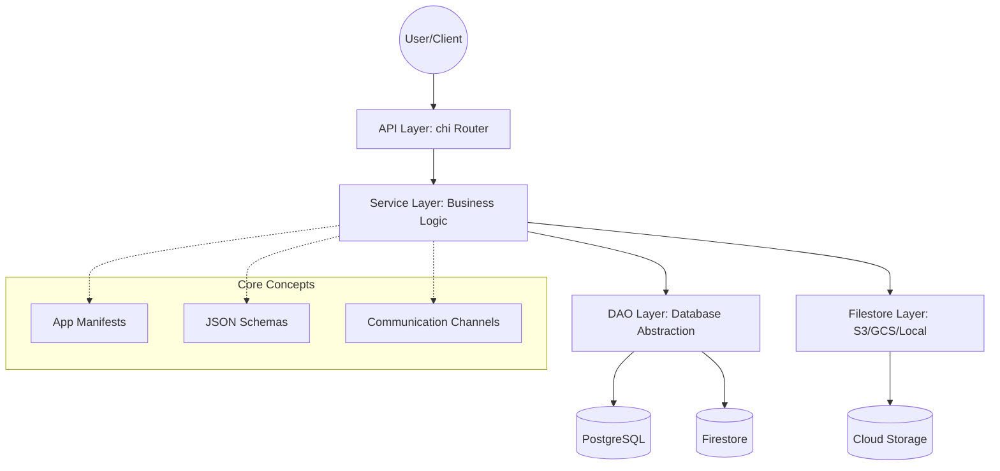

# AIGenApp Architecture

This document describes the high-level architecture of AIGenApp, its core concepts, and how different components interact.

## Core Philosophy: Schema-on-Read

Unlike traditional CMS or ERP systems that create physical database tables for each entity, AIGenApp uses a **Single-Table JSON Store** approach. 

- **Persistence Layer**: All data is stored in a single table (e.g., `aigen_records` in Postgres or a single collection in Firestore).
- **Structure**: Each record consists of a Namespace (App), a Key (Unique ID), a JSON blob (`Rec`), and Metadata.
- **Flexibility**: Changes to schemas do not require SQL migrations. The application logic interprets the JSON data based on dynamic definitions.

---

## Key Concepts

### 1. Apps
An **App** in AIGenApp is a logical container for business logic, schemas, and data.
- **Discovery**: Defined in `apps/` directories via an `app_def.json` manifest.
- **Components**: An app includes its own schemas, default data, UI configurations, and documentation.
- **Isolation**: Roles and permissions are typically scoped to an App namespace.

### 2. Entities & Schemas
Data within an App is organized into **Entities**.
- **Schema**: Defined in JSON files (e.g., `crm_lead.json`). These schemas describe attributes, data types, validation rules, and UI hints (e.g., "this field is an email").
- **Dynamic Modeling**: Entities are "realized" at runtime. The `SchemaService` parses these definitions to provide CRUD operations and GraphQL types.

### 3. Channels
**Channels** represent the communication interfaces between the system and the outside world.
- **Multi-Channel**: Supports WhatsApp, Email, Signal, Telegram, etc.
- **Identity**: Channels map external platform IDs (e.g., a phone number) to internal User profiles.
- **Guest Support**: Each channel can be configured to allow or deny unauthenticated interactions.

### 4. Services (The Business Logic Layer)
Services are the heart of the system. They are responsible for business logic, data validation, and orchestration.
- **Stateless**: Services generally do not hold state themselves; they rely on DAOs for persistence.
- **Isolation**: Services should not know about HTTP or specific API details. They take a `context.Context` and specialized descriptors as input.
- **Examples**: `EntityService`, `AuthService`, `ChannelService`, `TempAccessService`.

### 5. APIs (The Transport Layer)
APIs handle the "outer shell" of the application.
- **Routing**: Built on `net/http` and `chi`.
- **Handling**: APIs parse HTTP requests (JSON, Multipart, Query params), enforce basic authentication (JWT Middleware), and delegate work to Services.
- **MCP API**: A specialized management API for administrative tasks (like clearing caches or managing temporary files).

---

## Architectural Layers

### Infrastructure Abstraction
AIGenApp is designed to be cloud-agnostic:
- **`IPrimaryDao`**: Abstracts the database (Postgres, Firestore, or Memory).
- **`IFileStore`**: Abstracts the storage (Local, S3, GCS, or Postgres-BLOB).

## Relationship & Data Flow

1. **Request**: A user sends a request to an API endpoint (e.g., `GET /api/entity/crm/lead/123`).
2. **Auth**: The `AuthMiddleware` verifies the JWT and populates the context with the user's role and identity.
3. **Logic**: The `EntityApi` calls the `EntityService`.
4. **Schema Check**: The `EntityService` consults the `SchemaService` to ensure the requested entity (`crm/lead`) is valid and the user has permission to read it.
5. **Fetch**: The `EntityService` calls the `IPrimaryDao` to retrieve the JSON record from the database.
6. **Transformation**: The data is mapped to the requested format (JSON or GraphQL) and returned up the chain.

## Extension Points

- **Downstream Apps**: Add new business domains by creating a folder in `apps/`.
- **Custom Tools**: Extend the agentic capabilities by adding tools to `core/agentic/tools/`.
- **New Channels**: Implement the `ChannelService` patterns for new messaging platforms.
