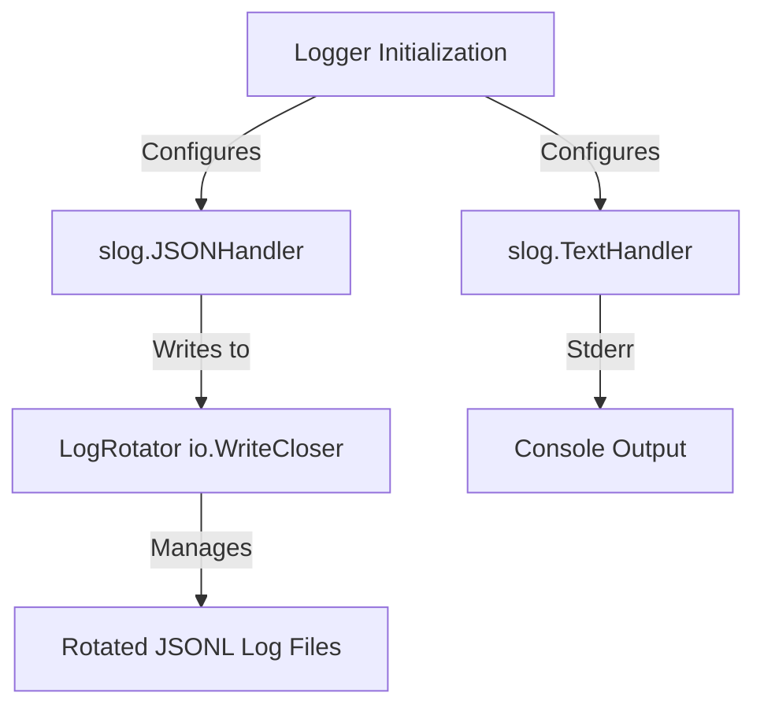

# Specification: Structured Logging & Log Rotation

## Background
The application currently uses Go's standard library `log` package. This prints unstructured text to standard output/error, lacking rotation, machine-readability (like JSONL), dynamic level selection, and context-based attributes. To resolve this and prevent log files from growing without bound, we need to implement a clean, dependency-free design pattern for concurrent structured logging (human-readable console + JSONL files) with automatic log rotation.

## Objectives
1. **Core Logger Configuration**: Implement structured logging utilizing standard `log/slog` which multiplexes to:
   - Console: Standard error, text-formatted logs.
   - File: Log file in a given directory, JSONL-formatted logs.
2. **Log Rotator**: Implement a thread-safe `LogRotator` that acts as an `io.WriteCloser` with size-based rotation and chronological prune limits (retention of N historical files).
3. **Traceability (Source Location Preservation)**: Maintain correct calling source file/line numbers even when logs are routed through wrapper APIs.
4. **Application Integration**: Update the application configuration and replace standard `log` usage with the new structured logging.

## Architectural Design
The architecture maps to the design pattern specified in `structured_logging_pattern.md`:

## Detailed Requirements

### 1. `LogRotator` (`rotator.go`)
- Thread-safe wrapper around `os.File` using `sync.Mutex`.
- Monitors file size after each write.
- Rotates when size exceeds limit, appending a timestamp suffix: `<base>.<YYYYMMDD-HHMMSS>.<ext>`.
- Deletes oldest historical backups beyond `maxBackups` limit.

### 2. `MultiHandler` (`logger.go`)
- Custom implementation of `slog.Handler` delegating to multiple child handlers.
- Supports `Enabled`, `Handle`, `WithAttrs`, and `WithGroup` correctly.

### 3. Application Integration
- Read logging parameters from `Config` (level, console status, file status, max size, max backups, dir, and filename).
- Provide a wrapper API for trace support, resolving caller PC dynamically bypassing wrapper helper frames.
